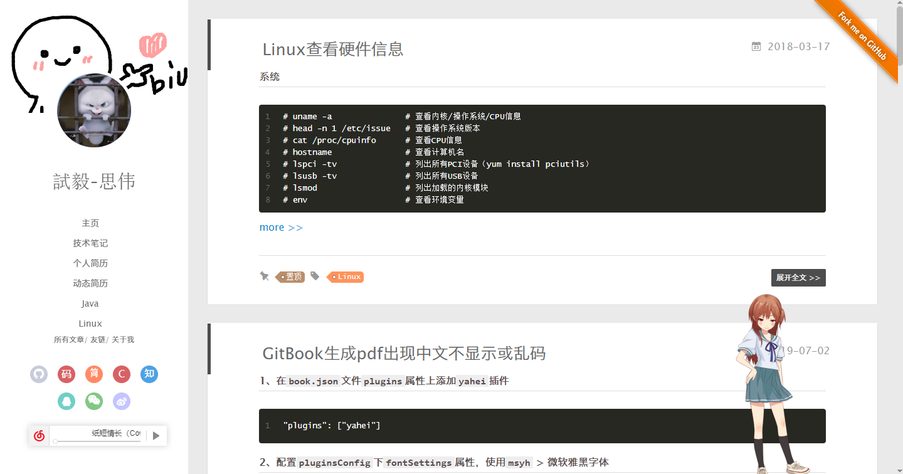

hexo-theme-yilia-plus
================


[](https://zhousiwei.gitee.io "Author")
[](http://hexo.io)
[](https://jq.qq.com/?_wv=1027&k=58Ypj9z "博客搭建交流群")
[](./LICENSE "LICENSE")


&#160;&#160;&#160;&#160;此项目是根据[hexo-theme-yilia](https://github.com/litten/hexo-theme-yilia)主题做了一些优化和改动，写这个项目的初衷就是深入学习`Hexo`。使用`yilia`主题可以快速迁移到`yilia-plus`

#### [立即体验](#三开始使用)

#### [项目支持](#其它项目支持)

> **欢迎使用和Star支持，如使用过程中碰到问题，可以提出Issue，我会尽力完善**

> **同时也欢迎相同爱好者加入一起维护此项目**

## 关于[hexo-theme-yilia-plus](https://github.com/JoeyBling/hexo-theme-yilia-plus)主题在原基础上做了以下功能升级
1. 手机端头像添加主页跳转链接
2. 集成不蒜子访问量统计功能
3. 网易云音乐插件
4. 页面点击小红心效果
5. 增加了多个SubNav导航图标展示
6. 添加GitHub Ribbons(Fork me)
7. 页脚 Litten自定义(弃用)
8. 添加版权声明
9. 添加百度站长平台主动推送
10. 集成 gitment 评论 ➡️ [https://github.com/JoeyBling/yilia-plus-demo](https://github.com/JoeyBling/yilia-plus-demo)
11. [集成码云评论](https://gitee.com/zhousiwei/giteement) ➡️ [https://gitee.com/zhousiwei/yilia-plus-demo](https://gitee.com/zhousiwei/yilia-plus-demo)
12. 添加网站成立年份
13. 页面加载进度条
14. 添加苹果图标
15. 标签页标题切换功能
16. 添加字数统计功能
17. 添加文字输入特效
18. 友情链接优化展示
19. 左侧边栏动态图效果、左侧导航栏支持滚动
20. 添加悬停预览图片效果
21. 其他样式轻微调优、社交图标优化
22. 优化配置是否在新窗口打开链接
23. [fix bugs](https://github.com/JoeyBling/hexo-theme-yilia-plus/wiki/fix-bugs-record%EF%BC%88%E4%BF%AE%E5%A4%8Dbug%E8%AE%B0%E5%BD%95%EF%BC%89)
24. [添加看板娘动态模型插件](https://github.com/JoeyBling/live2d-widget.js)
25. 添加飘雪特效
26. 自定义文章版权声明文本

> 如果有小伙伴有新功能的意见或者改进欢迎给我提意见和建议~


## 介绍
- 功能还很少，欢迎各位给我提意见和建议~
- **本项目源于：[https://github.com/litten/hexo-theme-yilia](https://github.com/litten/hexo-theme-yilia "https://github.com/litten/hexo-theme-yilia")。向作者表示深深的敬意。**

[yilia-plus](https://github.com/JoeyBling/hexo-theme-yilia-plus) 是为 [hexo](https://github.com/hexojs/hexo) 2.4+制作的主题。
崇尚简约优雅，以及极致的性能。 你可以点击 [我的博客](https://zhousiwei.gitee.io) 查看效果。

如果想体验手机浏览效果，可以扫一下二维码：


----------

## 鼓励

&#160;&#160;&#160;&#160;**如果觉得本主题还不错，您的支持和鼓励才是后续更新最大的动力，== 欢迎 [Star](https://github.com/JoeyBling/hexo-theme-yilia-plus/stargazers) ==**


## 关于主题：
1. 崇尚简约
2. 追求移动端体验
3. 希望把加载速度做到极致（努力中）
4. 让大家把注意力放到内容上。这是本主题设计初衷
5. 主题不支持IE6，7，8。以后也不会

## 一、外观

#### **常规**



## 二、开发者

&#160;&#160;&#160;&#160;为了性能和开发工程化考虑，[yilia-plus](https://github.com/JoeyBling/hexo-theme-yilia-plus) 需要使用`webpack`进行构建生成。
如果您对主题有一些定制化的需求，请参考wiki[《yilia-plus源码目录结构及构建须知》](https://github.com/JoeyBling/hexo-theme-yilia-plus/wiki/yilia-plus%E6%BA%90%E7%A0%81%E7%9B%AE%E5%BD%95%E7%BB%93%E6%9E%84%E5%8F%8A%E6%9E%84%E5%BB%BA%E9%A1%BB%E7%9F%A5)

#### 评论支持
- [Gitment](https://github.com/imsun/gitment)
- [基于码云的评论系统](https://gitee.com/zhousiwei/giteement)
- DISQUS
- 搜狐畅言

## 三、开始使用

#### 1、安装

```bash
cd ./themes/
git clone --depth=1 https://github.com/JoeyBling/hexo-theme-yilia-plus.git ./yilia-plus
```

#### 2、配置

修改hexo根目录下的 `_config.yml`  ➡️  `theme: yilia-plus`

#### 3、更新

```bash
cd themes/yilia-plus
git pull
```

## 四、配置

&#160;&#160;&#160;&#160;主题配置文件在主目录下的`_config.yml`，请根据自己需要修改使用。

> 完整配置Demo例子，可以参考[yilia-plus博客备份](http://github.com/JoeyBling/yilia-plus-demo)

```yaml
# Header-菜单
menu:
  主页: /
  技术笔记: https://zhousiwei.gitee.io/ibooks/
  随笔: /tags/随笔/

# subNav-子导航
subNav:
  github: "#"
  gitee: "#" # 码云
  jianshu: "#" #简书
  cnblog: "#"
  #blog: "#"
  #csdn: "#"
  #rss: "#"
  #zhihu: "#"
  #qq: "img/2434387555.jpg"
  #weixin: "img/weixin_.png"
  #weibo: "#"
  #douban: "#"
  #segmentfault: "#"
  #bilibili: "#"
  #acfun: "#"
  #mail: "mailto:zhousiwei0911@qq.com"
  #facebook: "#"
  #google: "#"
  #twitter: "#"
  #linkedin: "#"

# 悬停预览图片效果
hover_effect:
  ## `global` 0: Set separately, 1: Enable global 2: Close global
  ## `global` 0: 分开设置, 1: 全局启用, 2: 全局关闭
  global: 2
  # SubNav-导航
  subNav: true

# RSS订阅(关于如何配置启用:https://www.jianshu.com/p/2aaac7a19736)
rss: /atom.xml

# 是否需要修改 root 路径
# 如果您的网站存放在子目录中，例如 http://yoursite.com/blog，
# 请将您的 url 设为 http://yoursite.com/blog 并把 / 设为 /blog/。
root: /

# Content

# 文章太长，截断按钮文字(在需要截断的行增加此标记：<!--more-->)
excerpt_link: more
# 文章卡片右下角常驻链接，不需要请设置为false
show_all_link: '展开全文'
# 数学公式
mathjax: false

# Open link in a new tab | 是否在新窗口打开链接
open_in_new:
  article: true  # 文章链接
  menu: true   # 导航菜单
  subNav: true  # 子菜单

# 打赏
# 打赏type设定：0-关闭打赏； 1-文章对应的md文件里有reward:true属性，才有打赏； 2-所有文章均有打赏
reward_type: 2
# 打赏wording
reward_wording: '谢谢你请我吃糖果'
# 支付宝二维码图片地址，跟你设置头像的方式一样。比如：/assets/img/alipay.jpg
alipay: /img/alipay.jpg
# 微信二维码图片地址
weixin: /img/weixin.png

# 目录
# 目录设定：0-不显示目录； 1-文章对应的md文件里有toc:true属性，才有目录； 2-所有文章均显示目录
toc: 1
# 根据自己的习惯来设置，如果你的目录标题习惯有标号，置为true即可隐藏hexo重复的序号；否则置为false
toc_hide_index: true
# 目录为空时的提示
toc_empty_wording: '目录，不存在的…'

# 是否有快速回到顶部的按钮
top: true

# Miscellaneous
# 百度统计
baidu_analytics: ''
google_analytics: ''

# 网站图标
favicon: /favicon.ico

# 你的头像url
avatar: /img/head.jpg

# 是否开启分享
share_jia: true

# 评论：1、畅言；2、Disqus；3、Gitment；4、Giteement
# 不需要使用某项，直接设置值为false，或注释掉
# 具体请参考wiki：https://github.com/JoeyBling/hexo-theme-yilia-plus/wiki

# 1、畅言
changyan_appid: false
changyan_conf: false

# 2、Disqus 在hexo根目录的config里也有disqus_shortname字段，优先使用yilia-plus的
disqus: false

# 3、Gitment----基于GitHub的评论系统(关闭请设置gitment_owner为false)
# 关于如何集成:https://www.jianshu.com/p/ac7658cc912f
gitment_owner: false      #你的 GitHub ID
# 是否使用官方js(false可以提升访问速度，本地修改过一部分的js，官方js可能会出现服务器不稳定，不太建议使用)
gitment_remote: false
gitment_repo: ''          #存储评论的 repo name(需要在Github创建)
gitment_oauth:
  client_id: ''           #client ID
  client_secret: ''       #client secret

# 4、Giteement----【国内用户建议使用这个，相对比较快】
# 关于如何集成:https://www.jianshu.com/p/f5c4633524c7
# 基于码云的评论系统(https://gitee.com/zhousiwei/giteement)
giteement:
  enable: false  # 是否启用码云评论系统
  # 是否使用官方js(false可以提升访问速度)
  remote: false
  redirect_uri: ''   # 应用回调地址(请和配置的第三方应用保持一致)
  # 不能更改(网上开源项目`https://github.com/Rob--W/cors-anywhere`作者提供的专门用来跨域服务器的配置)
  oauth_uri: https://cors-anywhere.herokuapp.com/https://gitee.com/oauth/token
  giteeID: ''  # 你的码云账号英文名
  # 存储评论的 repo name(需要在码云仓库创建公开仓库)
  repo: ''
  gitment_oauth:
    client_id: ''           #client ID
    client_secret: ''       #client secret

# 访问量统计功能(不蒜子)
busuanzi:
  enable: true
  site_visit: true  # 站点访问量显示
  article_visit: true  # 文章访问量显示

# 网易云音乐插件
music:
  enable: false
  # 播放器尺寸类型(1：长尺寸、2：短尺寸)
  type: 2
  #id: 1332647902  # 网易云分享的音乐ID(更换音乐请更改此配置项)
  autoPlay: true  # 是否开启自动播放
  # 提示文本(关闭请设置为false)
  text: '这似乎是首纯音乐，请尽情的欣赏它吧！'

# 页面点击小红心
clickLove:
  # (关闭请设置为false)
  enable: true

# GitHub Ribbons(https://github.blog/2008-12-19-github-ribbons/)
github:
  # (关闭请设置为false)
  url: https://github.com/JoeyBling/hexo-theme-yilia-plus

# 页脚 Litten(此配置项已弃用)
# 帮助我们让更多人可以更方便使用Hexo，请尽量不要修改此主题配置
pageFooter:
  litten: GitHub:<a href="https://github.com/JoeyBling/hexo-theme-yilia-plus" target="_blank">hexo-theme-yilia-plus</a>

# 开启百度站长平台自动推送(https://ziyuan.baidu.com/linksubmit/index)
baidu_push: false

# 版权声明
# 版权声明type设定：0-关闭版权声明； 1-文章对应的md文件里有copyright: true属性，才有版权声明； 2-所有文章均有版权声明
copyright_type: 2

# 网站成立年份(默认为 2018，若填入年份小于当前年份，则显示为 2018-2019 类似的格式)
since: 2018

# Progress Bar | 页面加载进度条
# Demo: http://github.hubspot.com/pace/docs/welcome/
# type: barber-shop|big-counter|bounce|center-atom|center-circle|
#       center-radar|center-simple|corner-indicator|flash|flat-top|
#       loading-bar|mac-osx|minimal
# color: black|blue|green|orange|pink|purple|red|silver|white|yellow|
progressBar:
  enable: false
  type: 'minimal'  # Keep Quotes | 保留引号避免出错(某些type会导致样式重叠排版错误)
  color: blue

# Apple Touch icon 苹果图标(关闭请设置为false)
apple_touch_icon: '/apple-touch-icon-180x180.png'

# Tab Title Change | 标签页标题切换
tab_title_change:
  enable: true
  left_tab_title: '(つェ⊂) 我藏好了哦~ '
  return_tab_title: '(*´∇｀*) 被你发现啦~ '

# https://github.com/willin/hexo-wordcount
# 是否开启字数统计(关闭请设置enable为false)
# 也可以单独在md文件里Front-matter设置`no_word_count: true`属性，来自定义关闭字数统计
word_count:
  enable: true
  # 只在文章详情显示(不在首页显示)
  only_article_visit: true

# 文字输入特效
# https://github.com/disjukr/activate-power-mode
activate_power_mode:
  enable: true
  # 使输入模式丰富多彩
  colorful: true
  # 是否开启摇动
  shake: false

# 飘雪特效
# https://github.com/MlgmXyysd/snow.js
snow: false

# 看板娘动态模型插件
## https://github.com/JoeyBling/live2d-widget.js
live2d:
  # (关闭请设置为false)
  enable: false
  # 模型名称(取值请参考：https://github.com/JoeyBling/hexo-theme-yilia-plus/wiki/live2d%E6%A8%A1%E5%9E%8B%E5%8C%85%E5%B1%95%E7%A4%BA)
  model: hibiki
  display:
    position: right # 显示位置：left/right(default: 'right')
    width: 145  # 模型的长度(default: 150)
    height: 315 # 模型的高度(default: 300)
    hOffset: 50 # 水平偏移(default: 0)
    #vOffset: -20 # 垂直偏移(default: -20)
  mobile:
    show: false # 是否在移动设备上显示(default: true)
    scale: 0.6 # 移动设备上的缩放(default: 0.5)
  react:
    opacity: 0.8 # 模型透明度(default: 0.7)

# 样式定制 - 一般不需要修改，除非有很强的定制欲望…
style:
  # 头像上面的背景颜色
  # header: '#D3D1DC'
  header: '#4d4d4d'
  gif:
    # 是否启用左侧边栏动态图效果
    enable: false
    # 自定义背景图路径(默认可以不设置，提供默认背景图)
    # path: /img/biubiubiu.gif
  # 右滑板块背景
  slider: 'linear-gradient(200deg,#a0cfe4,#e8c37e)'

# slider的设置
slider:
  # 是否默认展开tags板块
  showTags: false

# 智能菜单
# 如不需要，将该对应项置为false
# 比如
#smart_menu:
#  friends: false
smart_menu:
  innerArchive: '所有文章'
  friends: '友链'
  aboutme: '关于我'

# 友情链接
friends:
  技术笔记:  #网站名称
    #网站地址
    url: https://zhousiwei.gitee.io/ibooks/
    #网站图片(可忽略不写)
    img: https://zhousiwei.gitee.io/ibooks/favicon.ico
    #网站简介(可忽略不写)
    description: 记录工作和学习过程中的笔记：Java、前端开发、Hexo博客、聚合支付、Linux笔记、ElasticSearch、ELK日志分析
  GitHub:
    url: https://github.com/JoeyBling
  码云:
    url: https://gitee.com/zhousiwei
  简书:
    url: https://www.jianshu.com/u/02cbf31a043a
  CSDN:
    url: https://blog.csdn.net/qq_30930805

# 关于我
aboutme: 主要涉及技术：<br>Java后端开发、聚合支付、<br>公众号开发、开源爱好者、Linux<br><br>联系QQ:2434387555<br><br>很惭愧<br><br>只做了一点微小的工作<br>谢谢大家
```


## 其它项目支持

- ### 一款简洁优雅的hexo主题：[hexo-theme-yilia-plus](https://github.com/JoeyBling/hexo-theme-yilia-plus)
- ### 一款简洁优雅的VuePress主题：[vuepress-theme-yilia-plus](https://github.com/JoeyBling/vuepress-theme-yilia-plus)
- ### VuePress集成Live2D看板娘：[vuepress-plugin-helper-live2d](https://github.com/JoeyBling/vuepress-plugin-helper-live2d)
- ### VuePress回到页首插件Plus：[vuepress-plugin-gotop-plus](https://github.com/JoeyBling/vuepress-plugin-gotop-plus)

## 捐赠
&#160;&#160;&#160;&#160;**如果感觉对您有帮助，请作者喝杯咖啡吧，请注明您的名字或者昵称，方便作者感谢o(*￣︶￣*)o**

| 微信 | 支付宝 |
| :---: | :---: |
|  |  |

### Hexo博客优化
- [Hexo博客集成码云评论系统](https://www.jianshu.com/p/f5c4633524c7)
- [Hexo博客集成Gitment评论](https://www.jianshu.com/p/ac7658cc912f)
- [Hexo 编译文档时 JS或HTML 混乱解决方案](https://www.jianshu.com/p/2a8b850d3f92)
- [Hexo博客配置RSS插件](https://www.jianshu.com/p/2aaac7a19736)
- [Hexo博客使用gulp压缩静态资源](https://www.jianshu.com/p/1123c89c491a)
- [新增Hexo博客文章置顶功能](https://www.jianshu.com/p/a0afac70afc8)
- [Hexo博客添加helper-live2d动态模型插件](https://www.jianshu.com/p/a7f4a42e4b49)
- [Hexo博客添加访问量统计](https://www.jianshu.com/p/c9f83d5b893a)
- [Hexo博客yilia主题添加背景音乐 （网易云音乐）](https://www.jianshu.com/p/f3fe5cb74d32)
- [使用Hexo+GitHub搭建免费个人博客](https://www.jianshu.com/p/efebead840b2)

## License

[](./LICENSE "LICENSE")
